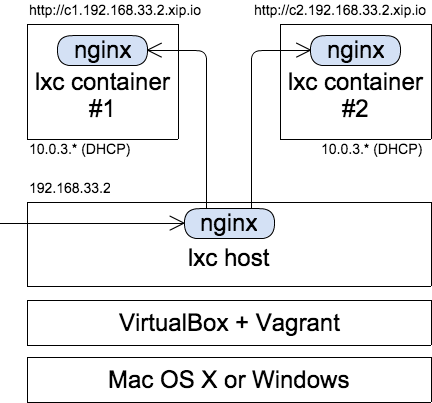

= Vagrant Shell Provisioner + Ansible + LXCのサンプル紹介
Presenter Hiroaki Nakamura
:backend: deckjs
:deckjs_transition: fade
:navigation:

== 誰？

* 中村 弘輝 (なかむら ひろあき)
** https://twitter.com/hnakamur2
** https://github.com/hnakamur
** http://qiita.com/hnakamur
* 株式会社ワンパク http://1pac.jp 大阪オフィス勤務
* サーバサイドエンジニア
* 最近やっていること
** Ruby on Rails, Ansible, LXC, Docker, AsciiDoctor

== なぜ今回LXCを使ったか？

* RAM 4GBのノートPCでVagrantで複数VMを同時起動するのはつらかったから
** 案件で2つのRailsアプリが連携するシステムを開発している
* 仕事の案件で客先よりLXCを使うという指定があったから

== なぜShell Provisionder？

* WindowsからAnsibleは実行できないが、Vagrant上のLinuxにAnsibleをインストールすればOK
* Macで使う場合もMac側にAnsibleインストール不要という利点がある
** VirtualBoxとVagrantだけインストールしておけばすぐ使える
* Ansibleインストール後Vagrant上のLinuxでAnsibleを実行
** 実行中の経過を表示するには `PYTHONUNBUFFERED` 環境変数を `true` にしておく

----
export PYTHONUNBUFFERED=true
cd /vagrant/provisioning
ansible-playbook lxc_host.yml
----

== 今回の構成

== 作ったAnsibleプレーブック

* ソース: https://github.com/hnakamur/lxc-ansible-playbooks
* ライセンス: MIT
* 対応ディストリビューション: Ubuntu 14.04とCentOS 6.5

== Ansible Connection Plugin for lxc containers

* https://github.com/Mic92/ansible-lxc
* これを使えばコンテナにsshd不要
* 依存コンポーネントとして https://github.com/lxc/python2-lxc が必要
** lxc公式にバンドルされているliblxcバインディングはPython3
** Ansibleは現状Python3非対応のためpython2-lxcが必要
* Ansibleでコンテナに接続するにはコンテナ名を指定 (IPアドレス不要)
** `lxc-attach --active` を使ったスクリプトでDynamic Inventoryを実現

== コンテナのIPアドレス取得

* LXCホスト上のnginxからコンテナのnginxにプロキシするためにコンテナのIPアドレスを知りたい
* Ubuntuのlxcなら `lxc-ls --fancy` でコンテナのIPアドレスが取得可能
* しかしCentOSの `lxc-ls` は `--fancy` が使えない
* `lxc-attach` でコンテナ上で `ip` コマンドを実行してIPアドレスを取得

----
lxc-attach -n {{ container_name }} -- ip a show eth0 | awk '$1=="inet" {sub(/\/[0-9]+/, ""); print $2}'
----

== まとめ

* Vagrant Shell ProvisionderでAnsibleをインストールすればWindows上でもOK
* Ansible Connection Plugin for lxc containersを使えばコンテナにsshd不要

なお、その後客先指定がlxcからdockerに変わったので実運用はしていません、あしからず。
